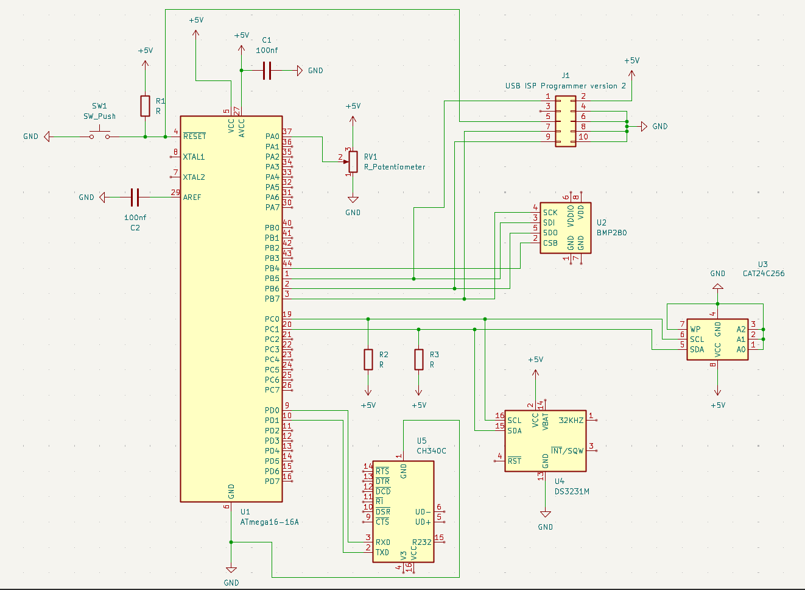

# ATmega16 Multiprotocol Embedded Data Acquisition System

A bare-metal embedded data acquisition system based on the **ATmega16 8-bit AVR microcontroller**. The system integrates multiple communication protocols and peripheral interfaces to acquire, process, display, and store data from different sensors and input devices.

The project demonstrates the integration of **ADC, I²C/TWI, SPI, UART, RTC, EEPROM, and digital pressure/temperature sensing** using low-level C drivers without relying on ready-made peripheral libraries.

---

## Features

* ATmega16-based embedded data acquisition
* Internal **8 MHz RC oscillator**
* Bare-metal C firmware
* Analog data acquisition using the built-in ADC
* Real-time clock using **DS3231**
* Temperature and pressure measurement using **BMP280**
* Nonvolatile data storage using **AT24C256 EEPROM**
* PC communication through **CH340 USB-UART**
* Modular peripheral drivers
* Structured data records stored in EEPROM
* Page-aware EEPROM write operations
* EEPROM write-complete detection using ACK polling
* UART-based real-time data monitoring

---

## System Overview

The system acquires data from multiple sources and stores the acquired information in a structured format.

### Data Sources

| Device/Input                 | Interface | Purpose                  |
| ---------------------------- | --------- | ------------------------ |
| Potentiometer / Analog Input | ADC       | Analog measurement       |
| DS3231 RTC                   | I²C/TWI   | Date and time            |
| BMP280                       | SPI       | Temperature and pressure |
| AT24C256                     | I²C/TWI   | Nonvolatile data storage |
| CH340                        | UART      | PC communication         |

The ATmega16 acts as the central controller and manages all peripheral communication.

---

## System Architecture

```text
                 ┌─────────────────────┐
                 │      ATmega16       │
                 │   8 MHz Internal RC │
                 └──────────┬──────────┘
                            │
        ┌───────────────────┼────────────────────┐
        │                   │                    │
        ▼                   ▼                    ▼
   ┌─────────┐        ┌──────────┐        ┌──────────┐
   │   ADC   │        │ I²C/TWI  │        │   SPI    │
   └────┬────┘        └────┬─────┘        └────┬─────┘
        │                  │                   │
        ▼             ┌────┴─────┐             ▼
 Analog Input         │          │          BMP280
                      ▼          ▼
                  DS3231      AT24C256
                     RTC        EEPROM
                             
                            │
                            ▼
                     ┌─────────────┐
                     │ UART / CH340│
                     └──────┬──────┘
                            │
                            ▼
                       PC / PuTTY
```

---

## Communication Interfaces

### ADC

The ATmega16 internal ADC is used to acquire the analog input.

* ADC channel: **ADC0 / PA0**
* Reference: **AVCC**
* Result: Right adjusted
* ADC prescaler: **128**

### I²C / TWI

The I²C/TWI interface is used for communication with both the DS3231 RTC and AT24C256 EEPROM.

* Communication speed: **100 kHz**
* Prescaler: **1**
* DS3231: Time and date information
* AT24C256: Nonvolatile data storage

### SPI

The SPI interface is used to communicate with the BMP280 sensor.

* SPI mode: **Mode 0**
* Clock frequency: **500 kHz**
* SS: PB4
* MOSI: PB5
* MISO: PB6
* SCK: PB7

### UART

UART provides communication between the ATmega16 and a PC through the CH340 USB-UART interface.

* Baud rate: **9600 baud**
* Data bits: **8**
* Parity: **None**
* Stop bits: **1**
* Format: **9600 8N1**

---

## EEPROM Data Format

Each acquisition record occupies **17 bytes** in the AT24C256 EEPROM.

| Data        |         Size |
| ----------- | -----------: |
| Seconds     |       1 byte |
| Minutes     |       1 byte |
| Hours       |       1 byte |
| Day         |       1 byte |
| Date        |       1 byte |
| Month       |       1 byte |
| Year        |       1 byte |
| Temperature |      4 bytes |
| Pressure    |      4 bytes |
| ADC Value   |      2 bytes |
| **Total**   | **17 bytes** |

The records are stored sequentially starting from EEPROM address `0x0000`.

The AT24C256 provides **32 KB (32768 bytes)** of storage, allowing approximately **1927 complete 17-byte records**.

---

## Firmware Structure

The firmware is divided into separate drivers to simplify development, debugging, and maintenance.

```text
ATmega16-Multiprotocol-DAQ/
│
├── main.c
├── uart.c
├── uart.h
├── adc.c
├── adc.h
├── i2c.c
├── i2c.h
├── spi.c
├── ds3231.c
├── ds3231.h
├── bmp280.c
├── bmp280.h
├── at24c256.c
├── at24c256.h
├── config.h
├── Makefile
│
├── README.md
│
└── Documentation/
    ├── Schematic/
    └── Results/
```

---

## Main Program Flow

The firmware follows the following acquisition sequence:

```text
Initialize UART
      ↓
Initialize ADC
      ↓
Initialize I²C
      ↓
Initialize SPI
      ↓
Initialize DS3231
      ↓
Initialize BMP280
      ↓
Initialize AT24C256
      ↓
Read RTC
      ↓
Read ADC
      ↓
Read BMP280
      ↓
Create Data Record
      ↓
Display Data through UART
      ↓
Store Record in EEPROM
      ↓
Move to Next EEPROM Address
      ↓
Repeat
```

---

# Hardware Schematic

The complete circuit schematic of the project is shown below.

## Schematic Diagram



**Figure:** Complete circuit schematic of the ATmega16 Multiprotocol Embedded Data Acquisition System.

---

# Experimental Results

The developed system was tested by programming the ATmega16, checking peripheral operation, acquiring sensor/input data, and monitoring the output through the UART interface.

## Results

> **[ PUTTY OUtput (UART) ]**


```markdown


**Figure:** PuTTY serial output showing acquired data from the ATmega16 system.
```

## Build Requirements

### Software

* AVR-GCC
* GNU Make
* Git Bash / compatible terminal
* ProgISP for programming the ATmega16
* PuTTY or another serial terminal

### Hardware

* ATmega16
* DS3231 RTC module
* AT24C256 EEPROM
* BMP280 sensor
* CH340 USB-UART module
* Potentiometer / analog input
* USB ISP programmer
* 5 V power supply
* Connecting wires and breadboard

---

## Building the Firmware

The project uses a Makefile for compilation.

From the project directory:

```bash
make
```

To remove previously generated object files and output files:

```bash
make clean
```

The firmware is compiled for:

```text
ATmega16
F_CPU = 8 MHz
```

The main compiler options include:

```text
-mmcu=atmega16
-DF_CPU=8000000UL
-Os
-Wall
-Wextra
-std=c11
```

---

## Programming

The generated `.hex` file can be programmed into the ATmega16 using the **ProgISP USB ISP Programmer**.

The programming sequence is:

```text
Source Code
     ↓
    make
     ↓
 main.hex
     ↓
 ProgISP
     ↓
 ATmega16
```

---

## Serial Monitoring

After programming and powering the circuit:

1. Connect the CH340 USB-UART interface to the PC.
2. Identify the assigned COM port.
3. Open PuTTY or another serial terminal.
4. Configure the terminal for:

```text
Baud Rate : 9600
Data Bits : 8
Parity    : None
Stop Bits : 1
Flow Ctrl : None
```

The ATmega16 then transmits acquired data through UART.

---

## Technologies Used

* **Microcontroller:** ATmega16
* **Programming Language:** C
* **Compiler:** AVR-GCC
* **Build System:** GNU Make
* **RTC:** DS3231
* **EEPROM:** AT24C256
* **Pressure/Temperature Sensor:** BMP280
* **USB-UART:** CH340
* **Protocols:** ADC, I²C/TWI, SPI, UART
* **Programmer:** USB ISP Programmer v2 / ProgISP

---

## Project Objectives

The main objectives of this project are:

1. To implement a multiprotocol embedded data acquisition system using the ATmega16.
2. To interface multiple peripherals using different communication protocols.
3. To develop low-level peripheral drivers using bare-metal C.
4. To acquire and process sensor and analog data.
5. To store structured acquisition records in external EEPROM.
6. To transmit acquired information to a PC through UART.
7. To demonstrate modular embedded firmware design.

---

## Future Scope

The system can be further extended with:

* Automated PC-side data retrieval
* CSV data export
* Real-time graphical visualization
* Wireless communication
* Additional sensors
* Larger external storage
* Command-based UART communication
* CRC/checksum-based data validation
* Measurement accuracy characterization
* Low-power operation

---

## Repository Structure

```text
ATmega16-Multiprotocol-DAQ/
│
├── Source Code
│   ├── main.c
│   ├── uart.c
│   ├── uart.h
│   ├── adc.c
│   ├── adc.h
│   ├── i2c.c
│   ├── i2c.h
│   ├── spi.c
│   ├── ds3231.c
│   ├── ds3231.h
│   ├── bmp280.c
│   ├── bmp280.h
│   ├── at24c256.c
│   ├── at24c256.h
│   └── config.h
│
├── Makefile
├── README.md
│
└── Documentation
    ├── Schematic
    │   └── ATmega16_DAQ_Schematic.png
    │
    └── Results
        ├── UART_Output.png
        ├── Hardware_Setup.png
        └── EEPROM_Test.png
```

---

## Project Documentation

The complete technical report contains detailed information about:

* System requirements and objectives
* System architecture
* Hardware design
* Communication protocol implementation
* Firmware design
* Data acquisition and EEPROM storage
* Experimental setup and results
* Hardware debugging and troubleshooting
* Applications
* Conclusion and future scope

---

## Author

**Aarnav Patel**

B.Tech. in Electronics & Communication Engineering
Institute of Technology, Nirma University

---

## License

This project is intended for educational and academic purposes.
